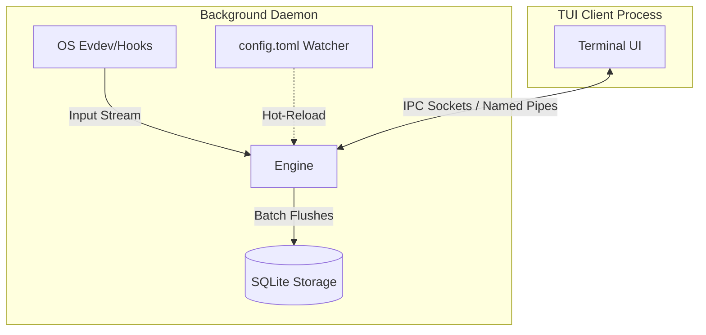
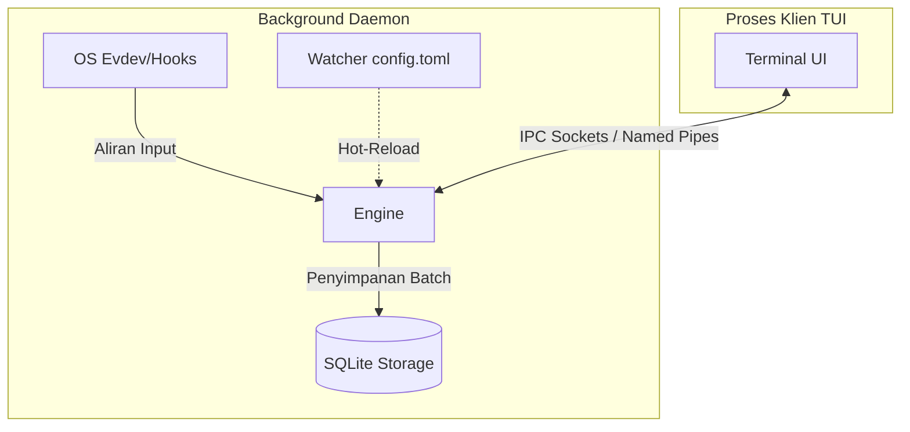

# 🧠 Static-Memory: Context-Aware Local Activity Logger

[English](#english) | [Bahasa Indonesia](#bahasa-indonesia)

---

<a name="english"></a>
## English

**Static-Memory** is an ultra-efficient local activity logging system designed specifically for users who prioritize data sovereignty and total privacy. Built with Rust and the Tokio asynchronous runtime, this project captures every keystroke and system metric with high precision, mapping them to the active window context without compromising system performance.

### 🏗️ System Architecture

Static-Memory operates on a strict **Daemon-Client Model** to ensure absolute separation between data recording and the interface visualization. This ensures no data is lost when the UI is closed and prevents database locking issues.

* **Background Daemon**: Runs as a persistent background service. Exclusively handles all OS input operations, privacy filters, and SQLite database management to eliminate database locking issues.
* **Thin TUI Client**: A lightweight terminal-based interface (~10-15 MB footprint). Communicates with the Daemon via Local IPC. When detached, the UI process terminates and resource consumption drops to zero, while the Daemon continues recording.

#### Performance Guarantees

| Metric | Performance Target |
| :--- | :--- |
| **RAM Usage** | 50 - 60 MB (Steady State Daemon) |
| **CPU Usage** | < 1% (Even during high input activity) |
| **Disk I/O** | Minimal (Optimized via SQLite WAL & Batch Flushing) |
| **Database Mode** | PRAGMA journal_mode = WAL, PRAGMA synchronous = NORMAL |



#### ⚡ Quick Start & Installation

##### Linux

The `install.sh` script compiles the daemon (verifying dependencies like `libx11-dev`) and installs a user-level `systemd` service for background persistence.

```bash
git clone https://github.com/rivadmorin/Static-Memory.git
cd Static-Memory
chmod +x install.sh
./install.sh
```

##### Windows

The `install.ps1` script compiles the release binary and adds it to your Startup folder or HKCU Registry for seamless background operation without UAC prompts.

```powershell
git clone https://github.com/rivadmorin/Static-Memory.git
cd Static-Memory
.\install.ps1
```

#### 🚀 Advanced Features

* **Idle/AFK Detection**: A 3-minute inactivity trigger that automatically halts KPM (Keystrokes Per Minute) recording. The engine transitions to an `[IDLE]` state (indicated by a red badge on the StatusBar) and accurately calculates AFK duration only when the user returns.
* **Data Retention & SQLite Log Rotation**: Utilizes a "Vacuum & Fresh Start" strategy. When the database reaches **50 MB**, the system archives it to `activity.[timestamp].db.bak` and starts a new database. A background worker periodically prunes old backups based on retention policies defined in `config.toml`.
* **Hot-Reloading config.toml**: Features a low-overhead configuration watcher (polling `std::fs::metadata` every 60 seconds). The `Arc<RwLock>` architecture allows privacy rules or window filters to be applied in real-time without restarting the daemon or UI.
* **Linux Input Resilience**: A robust asynchronous `evdev` stream handler. Equipped with a 5-second reconnect loop to dynamically recover from hot-plug events or peripheral disconnections.

#### ⌨️ TUI Control & Navigation Matrix

| Hotkey / Trigger | TUI Client Interaction | Core Engine State | Terminal Behavior / Impact |
| :--- | :--- | :--- | :--- |
| `static-memory` | Invokes & attaches interactive UI | Connected via IPC -> `[RECORDING]` | Terminal enters Alternative Raw Mode |
| `Space` or `p` | Freezes/unfreezes UI stream | Switches to `[PAUSED]` | Halts render loop for easy data scrolling |
| `Tab` / `Shift+Tab` | Shifts focus across UI panels | No Change | Navigates between active UI elements |
| `Right`/`Left`/`h`/`l` | Switches active layout Tabs | No Change | Toggles between Tab 1 (Timeline) & Tab 2 (Analytics) |
| `d` or `Ctrl + D` | Detaches interface safely | Automatically Resumes -> `[RECORDING]` | Restores terminal mode instantly, UI process dies |
| `q` or `Q` | Issues total Hard Shutdown | Sends KILL signal -> `[SHUTDOWN]` | Gracefully cleans buffers and terminates all processes |
| `Up`/`Down`/`j`/`k` | Scrolls lists line-by-line | No Change (Only in `[PAUSED]` mode) | Allows granular historical exploration |
| `PageUp`/`PageDown` | Jumps 10 lines at a time | No Change (Only in `[PAUSED]` mode) | Allows rapid historical exploration |
| `/` | Spawns interactive filter bar | No Change (Only in `[PAUSED]` mode) | Filters timeline apps/windows in real time |
| `Ctrl + E` | Displays Data Export Modal | No Change | Prompts for target format (.txt/.csv) and dates |
| `Ctrl + X` | Displays Data Purge Modal | No Change | Asks for confirmation to wipe all local records |
| `Esc` | Dimisses active Modal window | No Change | Returns focus safely back to the main layout screen |

#### 📂 Directory Structure & Compliance Standards

##### Linux (XDG Compliance)

* **Configuration**: `~/.config/static-memory/config.toml`
* **Data & Sockets**: `~/.local/share/static-memory/`

##### Windows (Standard AppData)

* **Configuration & Data**: `$env:APPDATA\Static-Memory\`

#### 📖 Further Documentation

* [Usage Guide, CLI Reference & IPC Protocol](./docs/usage.md)

#### 🛡️ License & Ethics

Static-Memory is licensed under MIT. This project was created for personal productivity and self-quantified analysis. Please use it responsibly and respect the privacy of others.

---

<a name="bahasa-indonesia"></a>
## Bahasa Indonesia

**Static-Memory** adalah sistem pencatat aktivitas lokal yang sangat efisien, dirancang khusus untuk pengguna yang memprioritaskan kedaulatan data dan privasi total. Dibuat dengan Rust dan runtime asinkron Tokio, proyek ini menangkap setiap ketukan tombol (keystroke) dan metrik sistem dengan presisi tinggi, lalu memetakan data tersebut ke konteks jendela (window) yang sedang aktif tanpa mengorbankan kinerja sistem.

### 🏗️ Arsitektur Sistem

Static-Memory berjalan di atas **Model Daemon-Client** yang ketat untuk memastikan pemisahan absolut antara proses perekaman data dan visualisasi antarmuka. Hal ini menjamin tidak ada data yang hilang saat UI ditutup dan mencegah terjadinya penguncian basis data (database locking).

* **Background Daemon**: Berjalan sebagai layanan latar belakang yang persisten. Menangani semua operasi input OS secara eksklusif, penyaringan privasi, dan manajemen basis data SQLite untuk mengeliminasi masalah penguncian database.
* **Thin TUI Client**: Antarmuka berbasis terminal (TUI) yang ringan (penggunaan memori ~10-15 MB). Berkomunikasi dengan Daemon melalui IPC Lokal. Ketika klien UI dilepas (detached), proses UI akan mati dan konsumsi sumber daya kembali menjadi nol, sementara Daemon terus merekam aktivitas di latar belakang.

#### Jaminan Kinerja

| Metrik | Target Kinerja |
| :--- | :--- |
| **Penggunaan RAM** | 50 - 60 MB (Daemon dalam kondisi stabil) |
| **Penggunaan CPU** | < 1% (Bahkan selama aktivitas input tinggi) |
| **Disk I/O** | Minimal (Dioptimalkan lewat SQLite WAL & Batch Flushing) |
| **Mode Database** | PRAGMA journal_mode = WAL, PRAGMA synchronous = NORMAL |



#### ⚡ Mulai Cepat & Instalasi

##### Linux

Skrip `install.sh` akan mengompilasi daemon (memverifikasi dependensi seperti `libx11-dev`) dan memasang layanan `systemd` tingkat pengguna (*user-level*) untuk persistensi latar belakang.

```bash
git clone https://github.com/rivadmorin/Static-Memory.git
cd Static-Memory
chmod +x install.sh
./install.sh
```

##### Windows

Skrip `install.ps1` mengompilasi biner rilis dan menambahkannya ke folder Startup Anda atau Registri HKCU untuk pengoperasian latar belakang tanpa hambatan UAC prompt.

```powershell
git clone https://github.com/rivadmorin/Static-Memory.git
cd Static-Memory
.\install.ps1
```

#### 🚀 Fitur Lanjutan

* **Deteksi Idle/AFK**: Pemicu ketidakaktifan selama 3 menit yang otomatis menghentikan perekaman KPM (Keystrokes Per Minute). Mesin akan beralih ke status `[IDLE]` (ditandai dengan badge merah di StatusBar) dan menghitung durasi AFK secara akurat hanya setelah pengguna kembali aktif.
* **Retensi Data & Rotasi Log SQLite**: Menggunakan strategi "Vacuum & Fresh Start". Ketika ukuran database mencapai **50 MB**, sistem akan mengarsipkannya menjadi `activity.[timestamp].db.bak` dan memulai database baru. Proses latar belakang secara berkala akan menghapus cadangan lama sesuai dengan kebijakan retensi yang ditentukan di `config.toml`.
* **Hot-Reloading config.toml**: Menggunakan pemantau konfigurasi overhead rendah (memeriksa `std::fs::metadata` setiap 60 detik). Arsitektur `Arc<RwLock>` memungkinkan aturan privasi atau filter jendela diterapkan secara waktu-nyata tanpa perlu menyalakan ulang daemon atau UI.
* **Resiliensi Input Linux**: Penanganan aliran asinkron `evdev` yang tangguh. Dilengkapi dengan perulangan koneksi ulang selama 5 detik untuk memulihkan koneksi secara dinamis saat terjadi pencabutan atau pemasangan perangkat periferal secara mendadak (hot-plug).

#### ⌨️ Matriks Kontrol & Navigasi TUI

| Tombol / Pemicu | Interaksi Klien TUI | Status Mesin Utama | Dampak / Perilaku Terminal |
| :--- | :--- | :--- | :--- |
| `static-memory` | Membuka & menautkan antarmuka interaktif | Terhubung via IPC -> `[RECORDING]` | Terminal memasuki Mode Raw Alternatif |
| `Space` atau `p` | Membekukan/mencairkan aliran UI | Beralih ke `[PAUSED]` | Menghentikan render loop untuk kemudahan menggulir data |
| `Tab` / `Shift+Tab` | Berpindah fokus antar panel UI | Tidak Ada Perubahan | Navigasi antar elemen UI yang aktif |
| `Right`/`Left`/`h`/`l` | Mengubah Tab tata letak aktif | Tidak Ada Perubahan | Beralih antara Tab 1 (Timeline) & Tab 2 (Analytics) |
| `d` atau `Ctrl + D` | Melepas antarmuka secara aman | Otomatis Melanjutkan -> `[RECORDING]` | Mengembalian mode terminal seketika, proses UI ditutup |
| `q` or `Q` | Mematikan sistem secara total | Mengirim sinyal KILL -> `[SHUTDOWN]` | Membersihkan buffer secara aman dan mematikan semua proses |
| `Up`/`Down`/`j`/`k` | Menggulir daftar baris-per-baris | Tidak Ada Perubahan (Hanya di mode `[PAUSED]`) | Memungkinkan penelusuran riwayat secara detail |
| `PageUp`/`PageDown` | Melompati 10 baris sekaligus | Tidak Ada Perubahan (Hanya di mode `[PAUSED]`) | Memungkinkan penelusuran riwayat secara cepat |
| `/` | Membuka bilah filter interaktif | Tidak Ada Perubahan (Hanya di mode `[PAUSED]`) | Menyaring aplikasi/jendela pada lini masa secara instan |
| `Ctrl + E` | Membuka Modal Ekspor Data | Tidak Ada Perubahan | Meminta format target (.txt/.csv) dan rentang tanggal |
| `Ctrl + X` | Membuka Modal Penghapusan Data | Tidak Ada Perubahan | Meminta konfirmasi untuk menghapus seluruh rekaman lokal |
| `Esc` | Menutup jendela Modal yang aktif | Tidak Ada Perubahan | Mengembalikan fokus dengan aman ke tampilan utama |

#### 📂 Struktur Direktori & Standar Kepatuhan

##### Linux (Kepatuhan XDG)

* **Konfigurasi**: `~/.config/static-memory/config.toml`
* **Data & Sockets**: `~/.local/share/static-memory/`

##### Windows (AppData Standar)

* **Konfigurasi & Data**: `$env:APPDATA\Static-Memory\`

#### 📖 Dokumentasi Lebih Lanjut

* [Panduan Penggunaan, Referensi CLI & Protokol IPC](./docs/usage.md)

#### 🛡️ Lisensi & Etika

Static-Memory dilisensikan di bawah Lisensi MIT. Proyek ini dibuat untuk produktivitas pribadi dan analisis diri. Harap gunakan secara bertanggung jawab dan hormati privasi orang lain.
