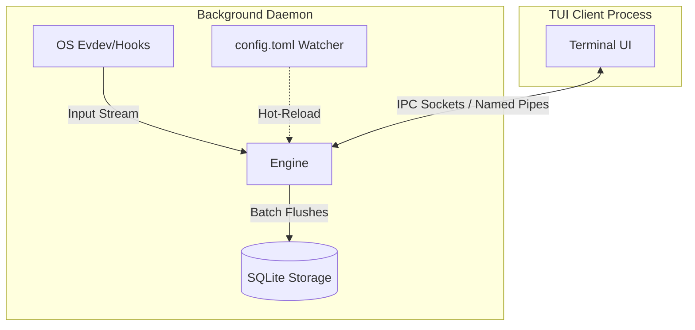

# 🧠 Static-Memory: Context-Aware Local Activity Logger

**Static-Memory** is an ultra-efficient local activity logging system designed specifically for users who prioritize data sovereignty and total privacy. Built with Rust and the Tokio asynchronous runtime, this project captures every keystroke and system metric with high precision, mapping them to the active window context without compromising system performance.

---

## 🏗️ System Architecture

Static-Memory operates on a strict **Daemon-Client Model** to ensure absolute separation between data recording and the interface visualization. This ensures no data is lost when the UI is closed and prevents database locking issues.

* **Background Daemon**: Runs as a persistent background service. Exclusively handles all OS input operations, privacy filters, and SQLite database management to eliminate database locking issues.
* **Thin TUI Client**: A lightweight terminal-based interface (~10-15 MB footprint). Communicates with the Daemon via Local IPC. When detached, the UI process terminates and resource consumption drops to zero, while the Daemon continues recording.

### Performance Guarantees

| Metric | Performance Target |
| :--- | :--- |
| **RAM Usage** | 50 - 60 MB (Steady State Daemon) |
| **CPU Usage** | < 1% (Even during high input activity) |
| **Disk I/O** | Minimal (Optimized via SQLite WAL & Batch Flushing) |
| **Database Mode** | PRAGMA journal_mode = WAL, PRAGMA synchronous = NORMAL |



---

## ⚡ Quick Start & Installation

### Linux

The `install.sh` script compiles the daemon (verifying dependencies like `libx11-dev`) and installs a user-level `systemd` service for background persistence.

```bash
git clone https://github.com/rivadmorin/Static-Memory.git
cd Static-Memory
chmod +x install.sh
./install.sh
```

### Windows

The `install.ps1` script compiles the release binary and adds it to your Startup folder or HKCU Registry for seamless background operation without UAC prompts.

```powershell
git clone https://github.com/rivadmorin/Static-Memory.git
cd Static-Memory
.\install.ps1
```

---

## 🚀 Advanced Features

* **Idle/AFK Detection**: A 3-minute inactivity trigger that automatically halts KPM (Keystrokes Per Minute) recording. The engine transitions to an `[IDLE]` state (indicated by a red badge on the StatusBar) and accurately calculates AFK duration only when the user returns.
* **Data Retention & SQLite Log Rotation**: Utilizes a "Vacuum & Fresh Start" strategy. When the database reaches **50 MB**, the system archives it to `activity.[timestamp].db.bak` and starts a new database. A background worker periodically prunes old backups based on retention policies defined in `config.toml`.
* **Hot-Reloading config.toml**: Features a low-overhead configuration watcher (polling `std::fs::metadata` every 60 seconds). The `Arc<RwLock>` architecture allows privacy rules or window filters to be applied in real-time without restarting the daemon or UI.
* **Linux Input Resilience**: A robust asynchronous `evdev` stream handler. Equipped with a 5-second reconnect loop to dynamically recover from hot-plug events or peripheral disconnections.

---

## ⌨️ TUI Control & Navigation Matrix

Below is a comprehensive guide to the system's control scheme and interactions:

| Hotkey / Trigger | TUI Client Interaction | Core Engine State | Terminal Behavior / Impact |
| :--- | :--- | :--- | :--- |
| `static-memory` | Invokes & attaches interactive UI | Connected via IPC -> `[RECORDING]` | Terminal enters Alternative Raw Mode |
| `Space` or `p` | Freezes/unfreezes UI stream | Switches to `[PAUSED]` | Halts render loop for easy data scrolling |
| `Tab` / `Shift+Tab` | Shifts focus across UI panels | No Change | Navigates between active UI elements |
| `Right`/`Left`/`h`/`l` | Switches active layout Tabs | No Change | Toggles between Tab 1 (Timeline) & Tab 2 (Analytics) |
| `d` or `Ctrl + D` | Detaches interface safely | Automatically Resumes -> `[RECORDING]` | Restores terminal mode instantly, UI process dies |
| `q` or `Q` | Issues total Hard Shutdown | Sends KILL signal -> `[SHUTDOWN]` | Gracefully cleans buffers and terminates all processes |
| `Up`/`Down`/`j`/`k` | Scrolls lists line-by-line | No Change (Only in `[PAUSED]` mode) | Allows granular historical exploration |
| `PageUp`/`PageDown` | Jumps 10 lines at a time | No Change (Only in `[PAUSED]` mode) | Allows rapid historical exploration |
| `/` | Spawns interactive filter bar | No Change (Only in `[PAUSED]` mode) | Filters timeline apps/windows in real time |
| `Ctrl + E` | Displays Data Export Modal | No Change | Prompts for target format (.txt/.csv) and dates |
| `Ctrl + X` | Displays Data Purge Modal | No Change | Asks for confirmation to wipe all local records |
| `Esc` | Dimisses active Modal window | No Change | Returns focus safely back to the main layout screen |

---

## 📂 Directory Structure & Compliance Standards

Static-Memory adheres to standard operating system paths to maintain data cleanliness and security:

### Linux (XDG Compliance)

* **Configuration**: `~/.config/static-memory/config.toml`
* **Data & Sockets**: `~/.local/share/static-memory/`

### Windows (Standard AppData)

* **Configuration & Data**: `$env:APPDATA\Static-Memory\`

---

## 📖 Further Documentation

* [Usage Guide, CLI Reference & IPC Protocol](./docs/usage.md)

---

## 🛡️ License & Ethics

Static-Memory is licensed under MIT. This project was created for personal productivity and self-quantified analysis. Please use it responsibly and respect the privacy of others.
