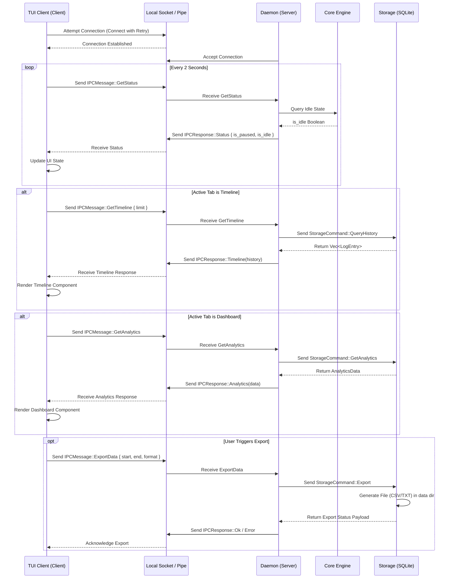

# Static-Memory Architecture Maps

## Codebase Directory Structure

```text
src/
├── collector/          # OS-specific input collection (keyboard, window context)
│   ├── keyboard.rs
│   ├── window.rs
│   └── mod.rs
├── engine/             # Core state logic and buffering
│   ├── buffer.rs
│   ├── tests.rs
│   └── mod.rs
├── models/             # Data structures and IPC payloads
│   └── mod.rs
├── os/                 # Platform abstractions and IPC connection layer
│   ├── ipc.rs
│   ├── linux.rs
│   ├── windows.rs
│   └── mod.rs
├── storage/            # SQLite database implementation and background thread
│   ├── db.rs
│   └── mod.rs
├── ui/                 # Thin TUI client implementation
│   ├── app.rs
│   ├── components/
│   │   ├── dashboard.rs
│   │   ├── modals.rs
│   │   └── status_bar.rs
│   └── mod.rs
├── lib.rs
└── main.rs
```

## Client-Daemon IPC Message Flow

The `Static-Memory` application uses a Daemon-Client model where the daemon handles background recording, database interactions, and state, while the thin client connects via Inter-Process Communication (IPC) using Unix Domain Sockets (Linux) or Named Pipes (Windows).

