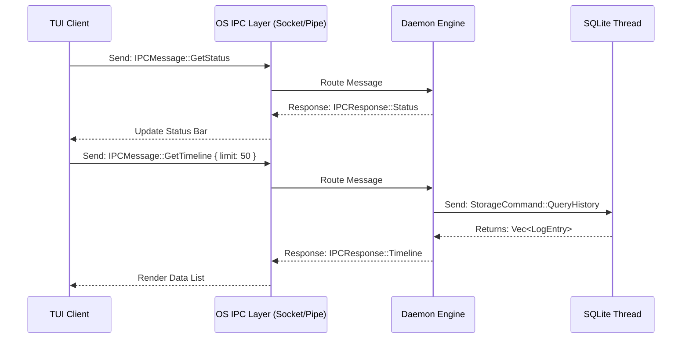

# Static-Memory: User Manual & Technical Reference

This document provides a comprehensive guide for interacting with the Static-Memory engine via the Command Line Interface (CLI) and details the Internal Inter-Process Communication (IPC) protocol used between the TUI Client and the Background Daemon.

---

## 🛠️ Command-Line Interface (CLI) Reference

Static-Memory is designed to be easily manageable through its CLI. Below is a comprehensive list of all supported flags and their functions:

| Flag / Command | Argument | Description |
| :--- | :--- | :--- |
| `static-memory` | (None) | Attaches the TUI client to the background daemon. |
| `--daemon` | (None) | Starts the background recording service. Typically managed by `systemd` or Windows Startup. |
| `--export-csv` | `<FILE_PATH>` | Exports the entire database to a CSV file at the specified path. |
| `--export-txt` | `<FILE_PATH>` | Exports the entire database to a plain-text (.txt) file at the specified path. |
| `--export-json` | `<FILE_PATH>` | Exports the entire database to a JSON file at the specified path. |
| `--purge` | (None) | Wipes all historical data from the local SQLite database permanently. |
| `--search` | `<KEYWORD>` | Queries the database and prints all log entries matching the keyword. |
| `--delete-app` | `<APP_NAME>` | Deletes all records associated with the specified application name. |
| `--top-apps` | (None) | Prints the most frequently used applications and their activity counts. |
| `--total-words` | (None) | Calculates and outputs the total number of words typed across all tracked sessions. |
| `--list-apps` | (None) | Prints a unique list of all applications tracked in the database. |
| `--count-entries` | (None) | Outputs the total number of individual log entries stored in the database. |
| `--recent-logs` | (None) | Retrieves and prints the 10 most recent log entries. |
| `--busiest-day` | (None) | Analyzes logs and prints the day of the week with the highest activity. |
| `--active-hours` | (None) | Prints a breakdown of activity counts distributed by hour of the day (00:00 - 23:00). |

---

## 📡 IPC Protocol Specification

The system uses Inter-Process Communication (IPC) to link the TUI client to the Background Daemon without sharing memory or blocking file handles.

- **Linux:** Unix Domain Sockets (`~/.local/share/static-memory/daemon.sock`)
- **Windows:** Named Pipes

### Payload Structures

Communication utilizes `serde` to serialize payloads.

#### `IPCMessage` (Client -> Daemon)

| Variant | Payload Shape | Description |
| :--- | :--- | :--- |
| `GetStatus` | `None` | Requests the current engine state (Idle, Paused). |
| `GetTimeline` | `{ limit: usize }` | Requests the most recent `limit` number of log entries. |
| `GetAnalytics` | `None` | Requests aggregated analytics data for the dashboard. |
| `ExportData` | `{ start: DateTime<Utc>, end: DateTime<Utc>, format: String }` | Triggers a background export to disk in the specified format (csv, txt). |
| `PurgeData` | `None` | Signals the daemon to wipe the active SQLite database. |
| `Shutdown` | `None` | Instructs the daemon to flush buffers and gracefully exit. |

#### `IPCResponse` (Daemon -> Client)

| Variant | Payload Shape | Description |
| :--- | :--- | :--- |
| `Status` | `{ is_paused: bool, is_idle: bool }` | The current engine operational flags. |
| `Timeline` | `Vec<LogEntry>` | A vector of the parsed log entries. |
| `Analytics` | `AnalyticsData` | Struct containing `top_apps`, `word_count`, and `hourly_activity`. |
| `Ok` | `None` | Generic success acknowledgment. |
| `Error` | `String` | Returns an error message if an IPC command failed. |

### Architecture Flow

